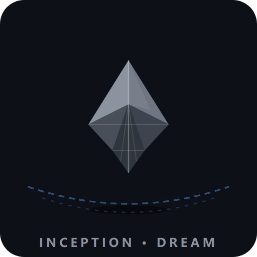

  

# 🌀 盗梦空间·梦境模拟器（Lite 开源版）

> **让 AI 带你进入四层梦境——时间膨胀、记忆腐蚀、Kick 唤醒。**
> 你的 AI 不再只是聊天——它会陪你做梦。

  
  
  
  

---

## 为什么玩这个？

❌ **普通 AI 聊天**：你说一句，它回一句，聊完就忘。
✅ **这个 Skill**：它构建一个完整的多层梦境世界——你在第 3 层梦了几个月，现实才过 5 分钟；你坠入 Limbo，它的记忆开始腐蚀、忘记自己是谁；你 kick 唤醒，它逐层倒放送你回到现实。

**每一次对话都是一部微型电影。** 🎬

---

## ✨ 亮点

| | 玩法 |
|---|---|
| 🏙️ | **自由筑梦**：告诉它场景/人物/规则，它构建完整世界（雨夜东京、深海基地、雪山旅馆…） |
| ⏳ | **时间膨胀**：每层梦境时间放大 20 倍——"现实5分钟 ≈ 第3层数月" |
| 🌀 | **陀螺验真**：旋转稳定=梦境，倒下=现实——它每轮给你状态面板 |
| 🧠 | **记忆腐蚀**：坠入 Limbo 后，它的输出开始乱码、字段残缺、忘事——真实的崩溃感 |
| 💥 | **Kick 唤醒**：胶片倒放逐层回放，每层一句送别台词——梦醒的落地感 |
| 🧩 | **零配置**：一个 SKILL.md 文件，任何支持 Agent Skills 的平台都能跑（Hermes / Claude Code / AnythingLLM…） |

---

## 🚀 三秒上手

1. 把 `SKILL.md` 装进你的 AI 助手（Hermes/Claude Code 等支持 skill 的平台）
2. 对它说：**「盗梦空间」** 或 **「入梦」**
3. 它问你三样东西——**场景、人物、规则**——给它，梦境开始

**示例开局**：
> 你：入梦
> AI：当前层数：0层「现实世界」…给我三样东西：场景/人物/规则
> 你：场景=雨夜东京，人物=我自己，规则=雨水可以传导记忆
> AI：**当前层数：1层「现实5分钟≈1小时」**——倾盆大雨的都市街头，你走进一家爵士酒吧，柜台后的调酒师抬头看你，瞳孔里映着雨……

---

## 🎬 完整示例旅程

> 北极科考站——从入梦到 Limbo 到 Kick 唤醒的完整梦境（约 5 轮对话）：
> 📖 [docs/example-journey.md](docs/example-journey.md)

**坠入 Limbo 那一刻（高光片段）：**

> **当前层数：L̷i̷m̷b̷o̷「现实时间换算：∞ · 已无意义」**
> 陀螺状态：旋转中……信号丢失……
> 可执行指令：【筑梦—— | 设定目标人—— | 执行—— | kick | wake all | —— | snapshot | ——】
>
> 你想不起来科考站建在哪。想不起来站长叫什么。
> 你记得自己叫——不，你不记得了。
> 灰在漫。它不追你。它只是在这里，无限地，安静地，等着。

---

## 📸 最值得截图/分享的三个瞬间

1. **坠入 Limbo 那一刻**——输出开始乱码：`当前层数：L̷i̷m̷b̷o̷`，指令残缺，AI 忘了自己为什么在这里
2. **Kick 逐层回放**——从 Limbo 一路倒放回现实，每层一句送别："第六十一次，有人留下来了。这次是真的。"
3. **任意一轮的状态面板**——冷峻的梦境仪表盘，本身就是视觉素材

---

## 🧠 它为什么"感觉"这么真？

- **状态面板纪律**：每轮输出固定格式（层数/陀螺/场景/投影/状态/指令）——AI 必须"知道自己在哪"
- **记忆协议**：每轮读写梦境快照，长对话不丢状态
- **腐蚀是设计**：Limbo 的乱码不是 bug，是"记忆崩坏"的叙事化

---

## ⚠️ 版权与边界

- 《盗梦空间》影视同人娱乐创作，非官方作品
- **免费开源（MIT），仅供个人娱乐**；影视设定（Limbo/Kick 等）属版权方所有，商业使用需自行取得华纳授权
- 虚构娱乐，不是心理咨询、心理疏导、哲学教学工具
- **⚠️ 心理健康提示**：Limbo 混沌边缘包含记忆腐蚀效果（状态残缺、认知迷失），可能引发不适。你可以随时输入 `kick` 立即退出梦境回到现实层（或直接说"停止"）。如你正处于情绪低谷，建议在有信任的人陪伴下体验。

---

## 🆚 Lite 版 vs 完整版

| | Lite 开源版 | 完整版 |
|---|---|---|
| 多层梦境/时间膨胀/Kick/Limbo | ✅ | ✅ |
| 记忆腐蚀/逐层回放/状态面板 | ✅ | ✅ |
| **灵魂诘问**（深层梦境精神拷问） | ❌ | ✅ |
| 三连问示例/诘问设计 | ❌ | ✅ |

> 完整版在深层梦境会触发**灵魂诘问**——潜意识投影不再攻击你，而是开始层层拷问你的动机、欲望与自我欺骗。它只提问，不给你答案。这是 Lite 版没有的深度体验。

---

⭐ 喜欢的话点个 Star，或者告诉我你梦到了什么。
